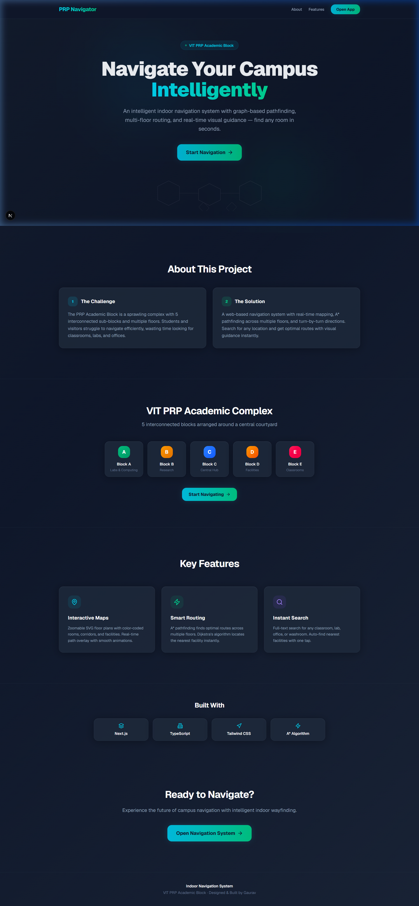
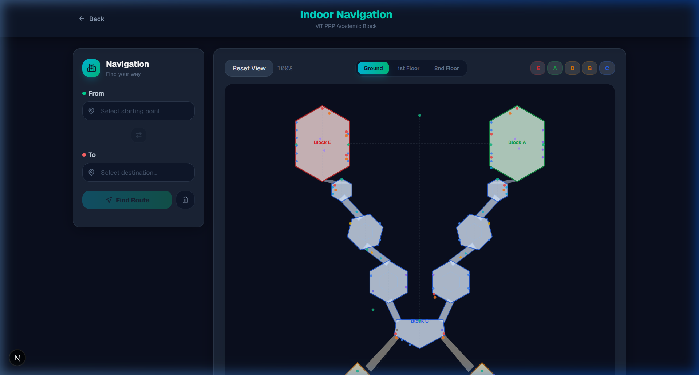
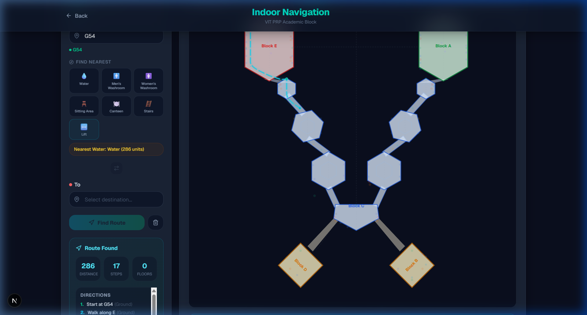

# 🧭 PRP Indoor Navigation

An interactive indoor navigation system for the **VIT PRP Academic Block** — a multi-floor building with 5 interconnected hexagonal blocks. Built with Next.js, React, and TypeScript.

> **Try it live:** [prp-indoor-navigation.vercel.app](https://prp-indoor-navigation.vercel.app)



---

## ✨ Features

- **Smart Pathfinding** — A\* and Dijkstra algorithms with pre-computed adjacency lists for O(1) graph lookups
- **Multi-Floor Navigation** — 3-floor support (Ground, 1st, 2nd) with automatic stair/elevator transitions
- **Find Nearest Facility** — One-tap search for water, washrooms, canteen, stairs, lifts, and sitting areas
- **Interactive SVG Map** — Zoom, pan, and click-to-focus on individual building blocks
- **Smooth Route Visualization** — Catmull-Rom curved paths with glow effects and animated waypoints
- **Floor Transition Alerts** — Visual banners showing when and how to change floors





---

## 🏗️ Architecture

```
app/
├── page.tsx                    # Landing page
├── navigation/page.tsx         # Main navigation app
├── layout.tsx                  # Root layout with metadata
└── globals.css                 # Global styles & animations

components/
├── building-map.tsx            # Map orchestrator (camera, zoom, pan)
├── navigation-panel.tsx        # Search panel with category filters
├── custom-cursor.tsx           # Custom cursor with spring physics
└── map/
    ├── map-controls.tsx        # Floor selector & zoom buttons
    ├── map-layers.tsx          # Static SVG building geometry
    ├── map-nodes.tsx           # Interactive node rendering
    └── map-route.tsx           # Route path overlay & info panel

lib/
├── pathfinding.ts              # A* + Dijkstra with Map-based lookups
├── prp-navigation-graph.ts     # Navigation graph (nodes, edges, floors)
├── prp-layout.ts               # Building geometry & visual config
├── building-data.ts            # Room search & category utilities
└── path-utils.ts               # SVG path smoothing (Catmull-Rom)
```

### Key Design Decisions

| Decision | Rationale |
|----------|-----------|
| **Pre-computed `Map` lookups** | `nodeMap`, `adjacencyList`, and `edgeMap` are built once at module load, replacing O(n) `Array.find()`/`filter()` in pathfinding hot loops |
| **Floor cloning mechanism** | Ground-floor graph is programmatically cloned to upper floors with name mapping, ensuring cross-floor geometric consistency |
| **Multi-layer SVG rendering** | 7 distinct layers (background → connectors → blocks → hexagons → spines → route → nodes → tooltip) prevent z-order conflicts |
| **Component decomposition** | Map split into 5 focused files — orchestrator handles state, sub-components own their rendering |

---

## 🚀 Getting Started

### Prerequisites

- **Node.js** ≥ 18
- **npm** ≥ 9

### Installation

```bash
# Clone the repository
git clone https://github.com/GauravHmm/PRP-Indoor-Navigation.git
cd PRP-Indoor-Navigation

# Install dependencies
npm install

# Start the development server
npm run dev
```

Open [http://localhost:3000](http://localhost:3000) in your browser.

### Build for Production

```bash
npm run build
npm start
```

---

## 🔧 Tech Stack

| Layer | Technology |
|-------|-----------|
| **Framework** | [Next.js 16](https://nextjs.org/) (App Router) |
| **Language** | TypeScript |
| **UI** | React 19 + Tailwind CSS 4 |
| **Icons** | [Lucide React](https://lucide.dev/) |
| **Pathfinding** | Custom A\* + Dijkstra |
| **Rendering** | SVG with Catmull-Rom curve smoothing |
| **Analytics** | [Vercel Analytics](https://vercel.com/analytics) |
| **Deployment** | [Vercel](https://vercel.com) |

---

## 📐 Building Layout

The PRP Academic Block consists of 5 hexagonal blocks connected through a central hub:

```
        Block E          Block A
           \              /
            \            /
             \          /
              Block C (Hub)
             /          \
            /            \
           /              \
        Block D          Block B
```

Each block contains rooms, corridors, stairwells, elevators, and service facilities — all encoded as a directed graph with ~250 nodes and ~230 edges per floor.

---

## 🗺️ Roadmap

- [ ] Real-time indoor positioning (BLE beacons / Wi-Fi fingerprinting)
- [ ] Progressive Web App (PWA) with offline support
- [ ] 3D floor visualization
- [ ] AR-guided navigation overlay
- [ ] Crowd density heatmaps
- [ ] Dynamic graph backend (Neo4j / PostgreSQL)

---

## 📄 License

This project is part of academic coursework at **VIT University**. All rights reserved.